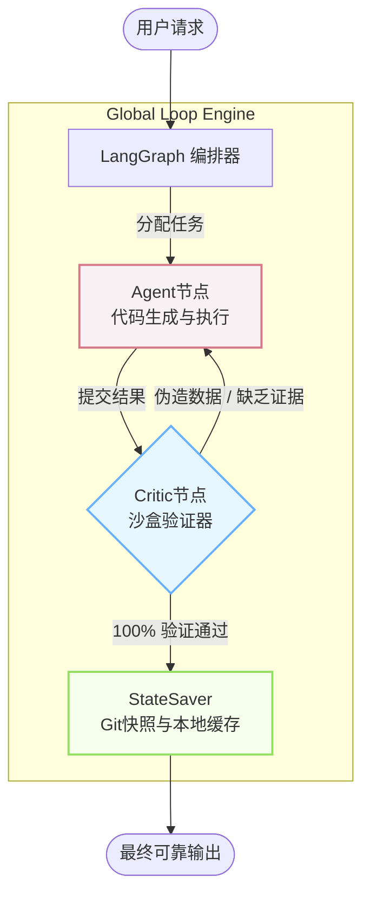

# Global Loop Engine


> **🌐 [English Documentation](README.md)**

**Global Loop Engine** 是一个基于 `LangGraph` 构建的强校验执行引擎，专为运行在 IDE 或 CLI 环境下的 LLM 编程智能体设计。它扮演着“无情把关人”的角色，强制 LLM 执行严格的 **“思考 → 执行 → 批判 → 修复”** 闭环，确保代码产出 100% 确定性，从根本上杜绝大模型的“幻觉”和“伪造测试通过”行为。

## ✨ 核心特性

*   **🛡️ 绝对真实的沙盒验证**：通过真实的子进程调用（如 `pytest`, `grep`）验证大模型的产出，拒绝任何口头承诺或 Mock 数据。
*   **🧊 状态冷热分离**：为防止 Token 爆炸，引擎仅向大模型传递高信息密度的增量（Diffs）和退出码（Exit Codes），实现超长上下文下的轻量级流转。
*   **🧬 幻觉防御器 (CriticNode)**：专设的批判节点，交叉比对底层日志与模型回复。一旦发现模型“脑补”成功指标，立即拦截并打回重做。
*   **⏱️ 原子级 Git 快照**：在关键操作前自动创建工作区快照。如果大模型陷入了乱改代码的死循环，引擎将安全执行全局回滚。
*   **⚙️ 危险指令高墙**：内置基于正则的黑名单校验，在到达宿主终端前，瞬间阻断 `rm -rf /`、`DROP TABLE` 等致命指令。

## 🏗 核心架构图



## 🚀 快速上手

### 1. 安装

克隆仓库并以开发者模式安装：

```bash
git clone https://github.com/WhitWei/global-loop-engine.git
cd global-loop-engine
cp .env.example .env
pip install -e .
```

### 2. 配置环境

打开 `.env` 文件，可自定义本地持久化数据库路径及重试阈值（默认配置已开箱即用）。

### 3. 使用方法

安装后即可在全局使用 `loop-engine` CLI 命令：

```bash
# 快速模式：执行一次严格的沙盒验证，拒绝无限重试
loop-engine --task "重构登录模块" --mode fast

# 循环模式：开启完整的 LangGraph 反思闭环，直到单元测试彻底通过
loop-engine --task "实现令牌桶算法并跑通所有单测" --mode loop
```

## 🧠 架构解析

引擎通过编译后的 **StateGraph** 驱动智能体：

1.  **ComplexityScorerNode**：评估任务复杂度，分配动态最大重试次数。
2.  **SanitizeNode**：预执行安全过滤器，拦截危险 shell 命令。
3.  **ExecuteNode**：在真实终端执行代码或单测，捕获 `stdout`、`stderr` 及 `exit_code`。
4.  **CriticNode**（核心）：担任“法官”角色，解析日志，鉴别幻觉，并决定流程的路由走向。
5.  **RefineNode**：在测试失败时，提取精确的错误指纹喂给大模型进行定向修复。

## 🤝 参与贡献

欢迎提出 Issue 和 PR！有关如何在本地搭建开发环境和运行端到端测试，请参阅 [贡献指南 (CONTRIBUTING.md)](CONTRIBUTING.md)。

## 📄 开源协议

本项目采用 Apache License 2.0 协议开源 - 详见 [LICENSE](LICENSE) 文件。
